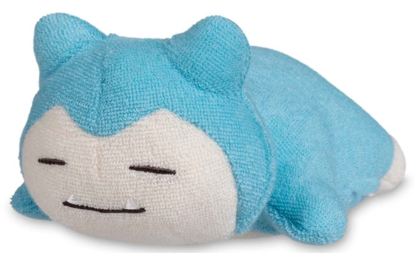
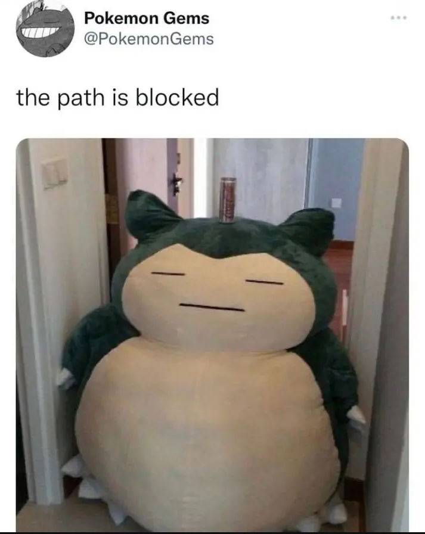

# Snorlax

## Description
Snorlax is a large, Pokémon characterized by its immense size and its penchant for sleeping and eating. 
It's a Normal-type Pokémon, first introduced in the original Pokémon games, Red and Blue, as one of the 151 original species.

## Habits
This gluttonous Pokémon eats constantly, apart from when it's asleep. 
It devours nearly 900 pounds of food per day. 
Terrifyingly strong, this Pokémon is the size of a mountain—and moves about as much as one as well.

"I was just minding my own business when this guy appeared in my way!" - Alisha
