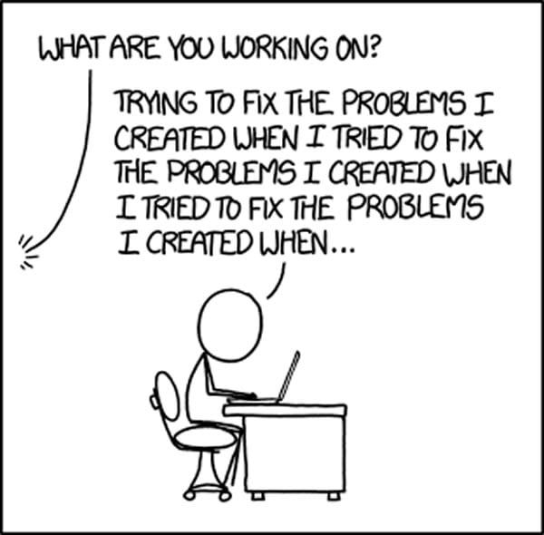

# Sample Portfolio
## Name: Nuhirath Rafthia
## Occupation: SWE
## Skills
- Python
- Java
- C
- C++
- HTML
- CSS
- Databases
- SQL
## My Journey

## Favorite Code
```python
def confuse_programmer():
    if True == False:
        return "Something's definitely wrong here!"
    elif True != True:
        return "Wait, what?"
    elif True and False or True:
        return "Okay, now I'm really confused."
    elif (True == True) != False:
        return "I give up!"
    else:
        return "Congratulations, you've successfully confused the programmer!"

print(confuse_programmer())